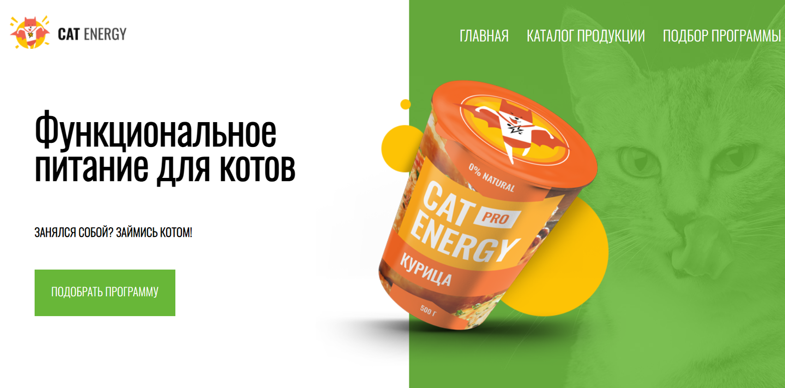

<!-- PROJECT LOGO -->
 

  

  

    <h2><a href="https://Anna-kadu.github.io/Project-CatEnergy/"><strong>Сайт питания для котов</strong></a></h2>
    <a href="https://github.com/Anna-kadu/Project-CatEnergy.git"><strong>Посмотреть код</strong></a>
     
    <a href="https://github.com/Anna-kadu/Project-CatEnergy/issues">Сообщить об ошибке</a>
    ·
    <a href="https://github.com/Anna-kadu/Project-CatEnergy/issues">Внести предложения</a>
  

<!-- TABLE OF CONTENTS -->

  
Содержание

  <ol>
    <li><a href="#о-проекте">О проекте</a></li>
    <li> <a href="#использованные-технологии">Использованные технологии</a></li>
    <li><a href="#функционал-сайта">Функционал сайта</a></li>
    <li><a href="#наша-команда">Наша команда</a></li>
  </ol>

## О проекте

Этот проект мы создали для практики своих frontend-навыков. 
С помощью нашего сайта пользователь может:
* выбрать программу похудения;
* выбрать питание;
* узнать цену;
* связаться с компанией.

## Использованные технологии

* 
* 
* 
* 

## Функционал сайта
* Адаптивность к разным устройствам
* Интегрированные Яндекс-карты

## Наша команда:

<h3>
  
</h3>
<h3>
  
</h3>
<h3>
  
</h3>
<h3>
  
</h3>
